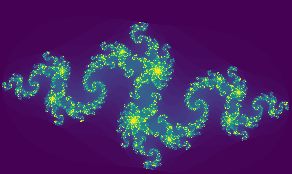
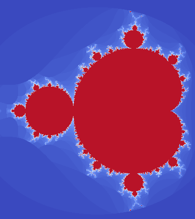

# Fractol

Fractol is a graphic project of 42 school curiculum realised in C.
The aim of this project is to program a Fractals explorer (see project subject [here]() or in ressource_and_assets repository).



The main objectives of the project is to:
* use the *minilibX* graphic library,
* tackle complex number in a programming project,
* address the problem of optimization in graphic project.

## Install & launch
```bash
git clone https://github.com/madvid/fractol
cd fractol && ./fractol <available fractal>
```

The program expects a parameter being the name of one of the available fractals.
Without parameter the usage will be displayed:
```bash
usage:
./fractol [fractal name]
[fractal name] has to be one of the following:
Julia
Mandelbrot
BurningShip
Newton
```

### Example :

Open the Mandelbrot fractal ⇣
```bash
./fractol Mandelbrot
```


### Remarks:
Default colorscale is viridis, this can be changed in the source code in the file ```mlx.c``` line 39. To see the available colorscale, refers colorscale functions to the files ```colorscale1.c``` and ```colorscale2.c```.

## Program interaction

When fractol program is running, you can interact with the fractal representation via a collection of actions;
* translations,
* zoom,
* colorscale change.

### Translations:
Translations can be performed via the following keyboard buttons:

<table width="100%">
<thead>
<tr>
<td width="65%" height="60px" align="center" cellpadding="0">
<strong>Description</strong>
</td>
<td width="10%" align="center" cellpadding="0">
<span style="width:70px">&nbsp;</span><strong>Key(s)</strong><span style="width:50px">&nbsp;</span>
</td>
</tr>
</thead>
<tbody>
<tr>
<td valign="top" height="30px">Tiny translation to the up</td>
<td valign="top" align="center"><kbd>&nbsp;▲&nbsp;</kbd></td>
</tr>
<tr>
<td valign="top" height="30px">Tiny translation to the down</td>
<td valign="top" align="center"><kbd>&nbsp;▼&nbsp;</kbd></td>
</tr>
<tr>
<td valign="top" height="30px">Tiny translation to the left</td>
<td valign="top" align="center"><kbd>&nbsp;◄&nbsp;</kbd></td>
</tr>
<tr>
<td valign="top" height="30px">Tiny translation to the right</td>
<td valign="top" align="center"><kbd>&nbsp;►&nbsp;</kbd></td>
</tr>
<tr>
<td valign="top" height="30px">Translation to the up</td>
<td valign="top" align="center"><kbd>&nbsp;z&nbsp;</kbd></td>
</tr>
<tr>
<td valign="top" height="30px">Translation to the down</td>
<td valign="top" align="center"><kbd>&nbsp;s&nbsp;</kbd></td>
</tr>
<tr>
<td valign="top" height="30px">Translation to the left</td>
<td valign="top" align="center"><kbd>&nbsp;q&nbsp;</kbd></td>
</tr>
<tr>
<td valign="top" height="30px">Move the fractal to the right</td>
<td valign="top" align="center"><kbd>&nbsp;d&nbsp;</kbd></td>
</tr>
</tbody>
</table>

### Zoom
Zoom/Unzoom operations can be performed via the following keyboard buttons:

<table width="100%">
<thead>
<tr>
<td width="65%" height="60px" align="center" cellpadding="0">
<strong>Description</strong>
</td>
<td width="10%" align="center" cellpadding="0">
<span style="width:70px">&nbsp;</span><strong>Key(s)</strong><span style="width:50px">&nbsp;</span>
</td>
</tr>
</thead>
<tbody>
<tr>
<td valign="top" height="30px">Increase the global size of the fractal / zoom</td>
<td valign="top" align="center"><kbd>&nbsp;+&nbsp;</kbd></td>
</tr>
<tr>
<td valign="top" height="30px">Decrease the global size of the fractal / unzoom</td>
<td valign="top" align="center"><kbd>&nbsp;-&nbsp;</kbd></td>
</tr>
</tbody>
</table>

### Colorscale change:
You can change the colorscale used in the rendering by using the keyboard button of the pad:

<table width="100%">
<thead>
<tr>
<td width="65%" height="60px" align="center" cellpadding="0">
<strong>Description</strong>
</td>
<td width="10%" align="center" cellpadding="0">
<span style="width:70px">&nbsp;</span><strong>Key(s)</strong><span style="width:50px">&nbsp;</span>
</td>
</tr>
</thead>
<tbody>
<tr>
<td valign="top" height="30px">viridis</td>
<td valign="top" align="center"><kbd>&nbsp;1&nbsp;</kbd></td>
</tr>
<tr>
<td valign="top" height="30px">magma</td>
<td valign="top" align="center"><kbd>&nbsp;2&nbsp;</kbd></td>
</tr>
<tr>
<td valign="top" height="30px">YlOrBr</td>
<td valign="top" align="center"><kbd>&nbsp;3&nbsp;</kbd></td>
</tr>
<tr>
<td valign="top" height="30px">mako</td>
<td valign="top" align="center"><kbd>&nbsp;4&nbsp;</kbd></td>
</tr>
<tr>
<td valign="top" height="30px">Coolwarm</td>
<td valign="top" align="center"><kbd>&nbsp;5&nbsp;</kbd></td>
</tr>
<tr>
<td valign="top" height="30px">Blue shades</td>
<td valign="top" align="center"><kbd>&nbsp;6&nbsp;</kbd></td>
</tr>
<tr>
<td valign="top" height="30px">Red shade</td>
<td valign="top" align="center"><kbd>&nbsp;7&nbsp;</kbd></td>
</tr>
<tr>
<td valign="top" height="30px">Green shade</td>
<td valign="top" align="center"><kbd>&nbsp;8&nbsp;</kbd></td>
</tr>
</tbody>
</table>

### Mouse controls
You can also performed zoom and unzoom operations via the mouse:
<table width="100%">
<thead>
<tr>
<td width="60%" height="60px" align="center" cellpadding="0">
<strong>Description</strong>
</td>
<td width="10%" align="center" cellpadding="0">
<span style="width:70px">&nbsp;</span><strong>Control(s)</strong><span style="width:50px">&nbsp;</span>
</td>
</tr>
</thead>
<tbody>
<tr>
<td valign="top" height="30px">Increase the global size of the fractal (aka zoom)</td>
<td valign="top" align="center"><kbd>&nbsp;scroll up&nbsp;</kbd></td>
</tr>
<tr>
<td valign="top" height="30px">Decrease the global size of the fractal (aka unzoom)</td>
<td valign="top" align="center"><kbd>&nbsp;scroll down&nbsp;</kbd></td>
</tr>
</tbody>
</table>

### Exit
Fractol can be existed normally in 2 ways:
* clicking the cross of the window,
* pressing the button <td valign="top" align="center"><kbd>&nbsp;esc&nbsp;</kbd></td>
</tr>

## Remarks on the interaction:
Based on your system and keyboard configuration, the interactions may not work.
This is due to key value corresponding to the button pressed. You need to refer to the key values mapping of your system/keyboard and modify the macros in the right part (apple / linux or add an extra part).

## Jupyternotebook: interpolation_multilineaire_colorscale.ipynb
This Jupyter notebook contain the python code developped to adjust several polynomial models on the different coloscale in the Seaborn python library.
We coefficients of the polynomial models are printed at the end to a preformated C, we just need to copy/paste the output directly.